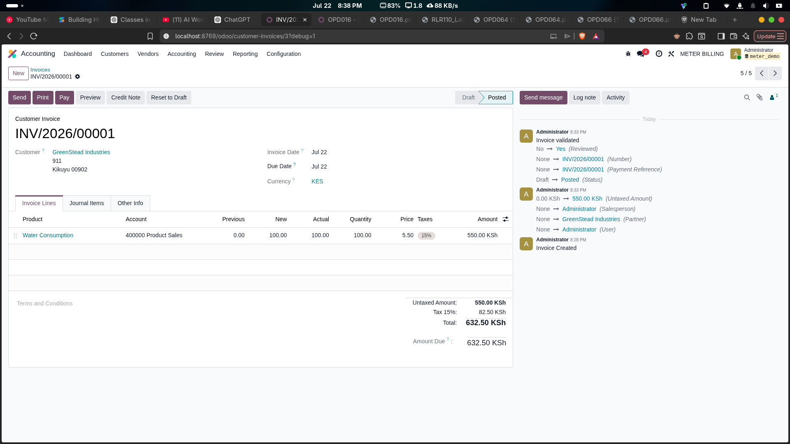
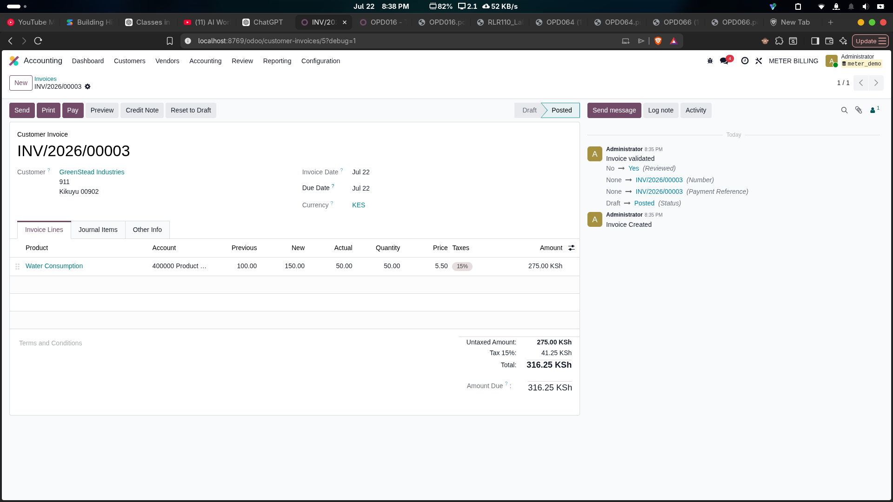
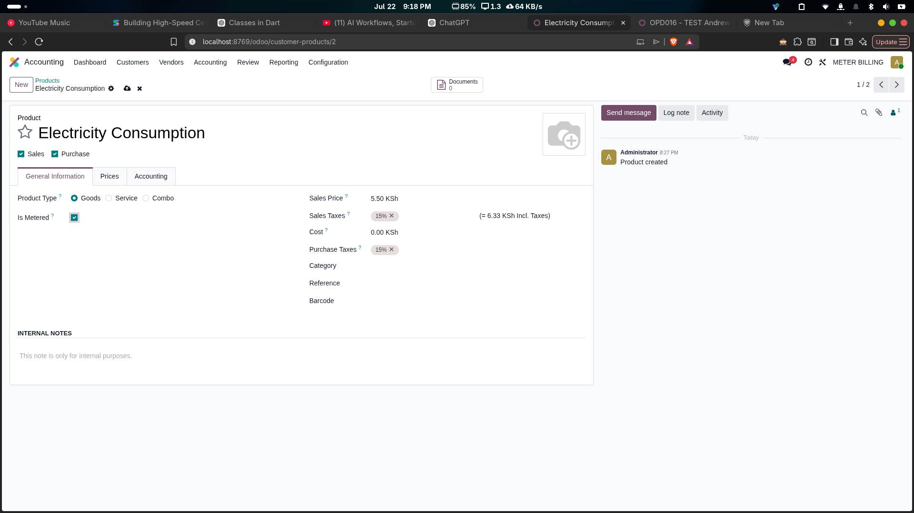

# Account Meter Billing

[](https://www.odoo.com)
[](__manifest__.py)

Adds meter-reading columns (Previous, New, Actual, Meter Serial) to invoice
lines and automatically maps the computed consumption to the standard Quantity
field. Designed for utility, water, electricity, or gas billing workflows where
charges are based on meter differential rather than discrete units.

## Table of Contents

- [Overview](#overview)
- [Screenshots](#screenshots)
- [Quick Start](#quick-start)
- [Architecture & Design Decisions](#architecture--design-decisions)
- [Complete Processing Flow](#complete-processing-flow)
- [Model / Audit Log](#model--audit-log)
- [Configuration](#configuration)
- [Security](#security)
- [Dependencies](#dependencies)
- [Installation](#installation)
- [Development & Testing](#development--testing)
- [Troubleshooting](#troubleshooting)
- [License](#license)

## Overview

| Capability | How it works |
|---|---|
| Historical meter lookup | `meter_previous` searches last posted invoice for same partner+product |
| Current reading entry | `meter_new` is an editable float stored on the invoice line |
| Automatic consumption | `meter_actual` = new - previous, floored at 0 |
| Quantity sync | `meter_actual` written to `quantity` so subtotals reflect usage |
| Meter serial tracking | `meter_serial` records physical meter identifier per line |
| Product gating | `is_metered` flag on products hides meter columns for non-utility items |
| PDF report columns | Meter Serial, Previous, New, Actual columns render before Quantity |

This module is for businesses that bill based on meter readings -- utility
companies, property managers, co-working spaces, or any recurring service
where consumption is measured at interval endpoints. The module does **not**
add an independent meter registry; it treats each invoice line as a snapshot
in a chain of readings for that partner-product pair.

## Screenshots

### First invoice -- baseline reading



*No prior reading exists, so Previous = 0.00. New = 1250.00 produces
Actual = 1250.00, Quantity = 1250.00, Subtotal = 4,375.00.*

### Second invoice -- automatic Previous fetch



*Previous auto-populated to 1250.00 (from INV-001). New = 1380.00 produces
Actual = 130.00, Quantity = 130.00, Subtotal = 455.00.*

### Is Metered product flag



*Enable meter columns per product by checking **Is Metered** on the product
form under the General Information tab.*

## Quick Start

1. **Set up products** -- Go to Products, open a product, check **Is Metered**.
2. **Install the module** -- Apps > Update Apps List > Install "Account Meter
   Billing".
3. **Create a customer invoice** -- Accounting > Customers > Invoices > Create.
4. **Add an invoice line** -- pick a metered product (e.g., "Water - per m3").
5. **Enter the New reading** -- type a value in the `New` column and optionally
   the meter serial. `Previous` and `Actual` update automatically.
6. **Post the invoice** -- the reading is saved. On the next invoice for the
   same partner and product, `Previous` populates from this invoice's `New`.

## Architecture & Design Decisions

### Why place meter fields on invoice lines instead of the invoice header

The three meter fields (`meter_previous`, `meter_new`, `meter_actual`) are
added to `account.move.line` rather than `account.move` for three reasons:

**1. Support for Multiple Meters on a Single Invoice**

A customer may be billed for multiple metered services on the same monthly
invoice (e.g., both Water and Electricity consumption). At the header level
you could only record one meter reading. On invoice lines, a single invoice
can have one line for Water and another for Electricity, each tracking
independent readings.

**2. Direct Integration with Odoo's Pricing Engine**

Odoo's pricing, tax, and subtotal calculations happen at the line level:
`Line Subtotal = Quantity x Unit Price`. Because the requirement specifies
that the billable Quantity must be derived from Actual usage, both the meter
fields and the standard quantity field must reside on the same model so they
can interact dynamically through computed field dependencies.

**3. Accurate Historical Lookup Per Product**

When looking up the Previous reading, the system must find the last reading
for that specific service. Line-level tracking allows per-product matching
(e.g., matching the previous Water line to the new Water line while ignoring
Electricity lines). At the header level there is no product identity to
match against.

### Why store computed fields instead of computing on the fly

```python
meter_previous = fields.Float(compute='_compute_meter_previous', store=True)
meter_actual = fields.Float(compute='_compute_meter_actual', store=True)
```

Storing means the values survive recomputation and are available in SQL
reports, search domains, and the PDF renderer without re-running the search
query every time. The tradeoff is slightly higher database storage -- four
extra fields per invoice line -- which is negligible for the vast majority of
Odoo deployments.

### Why map `meter_actual` to `quantity` inside the compute method

```python
@api.depends('meter_new', 'meter_previous')
def _compute_meter_actual(self):
    for line in self:
        actual = max(line.meter_new - line.meter_previous, 0.0)
        line.meter_actual = actual
        line.quantity = actual
```

Writing `line.quantity = actual` inside the compute method means that every
price, tax, and subtotal computation works automatically -- no need to
override `_compute_price` or modify the `account.move` validation logic.
The quantity is the actual consumption, so the line total becomes
`actual * unit_price`. This is the least-surprise path for Odoo's existing
accounting pipeline.

### Why exclude the current line from the historical lookup

```python
if line.id:
    domain.append(('id', '!=', line.id))
```

When editing an already-saved invoice line, the search for the last posted
reading would otherwise find the line itself (because it has `meter_new > 0`),
producing a self-referencing previous value. The `id !=` exclusion prevents
this cycle.

### Why filter by `move_type` in the lookup domain

```python
if line.move_id.move_type:
    domain.append(('move_id.move_type', '=', line.move_id.move_type))
```

A partner may receive both customer invoices (`out_invoice`) and vendor bills
(`in_invoice`). Restricting the search to the same `move_type` prevents a
vendor bill reading from leaking into a customer invoice's `Previous` field.

### Why an "Is Metered?" flag on products

In real-world usage, not all invoice lines are metered -- administrative fees,
consulting charges, and flat-rate services should not show meter columns.
Adding a boolean `is_metered` to `product.template` allows selective
visibility:

```python
product_is_metered = fields.Boolean(related='product_id.is_metered')
```

The meter fields in the invoice line list use
`invisible="not product_is_metered"`, keeping the UI clean for non-metered
products.

### Why a validation constraint on meter readings

A physical meter cannot go backwards. If a user accidentally enters a New
reading lower than Previous, the system should catch the mistake before the
invoice is saved or posted:

```python
@api.constrains('meter_new', 'meter_previous')
def _check_meter_readings(self):
    for line in self:
        if line.meter_previous and line.meter_new < line.meter_previous:
            raise ValidationError(
                f"For product '{line.product_id.name}', the New reading "
                f"({line.meter_new}) cannot be less than the Previous "
                f"reading ({line.meter_previous})."
            )
```

This raises a user-facing warning on save, preventing data entry errors.

### Why meter serial tracking

Utility customers often have specific physical meters installed on their
properties (e.g., "Serial No: W-99821"). Recording the serial on the
invoice line provides audit clarity and helps customers identify which
meter a reading belongs to, especially when multiple meters of the same
product type exist at one location.

## Complete Processing Flow

### Flow A -- Invoice line creation / editing

```
User selects product and partner
  │
  ├── _compute_meter_previous fires
  │     ├── domain: same partner, same product, posted, same move_type
  │     ├── order by id desc
  │     ├── limit 1
  │     └── meter_previous = result.meter_new or 0.0
  │
  ├── User enters meter_new value
  │     └── _compute_meter_actual fires
  │           ├── meter_actual = max(meter_new - meter_previous, 0.0)
  │           └── quantity = meter_actual
  │
  └── User clicks Save
        └── _check_meter_readings validates
              ├── if meter_new < meter_previous: ValidationError raised
              └── if valid: record saved

On invoice post:
  └── move_id.state -> 'posted'
        └── This line becomes the "previous" source
              for the next identical partner+product invoice
```

Steps:

1. User opens a new invoice or edits an existing draft.
2. Adding an invoice line triggers `_compute_meter_previous` via the
   `product_id` and `move_id.partner_id` dependencies.
3. `_compute_meter_previous` searches `account.move.line` for the most recent
   posted invoice line with the same partner, product, and `move_type` that
   has `meter_new > 0`.
4. The found line's `meter_new` is copied to the current line's
   `meter_previous`. If no prior line exists, `meter_previous` is 0.
5. User types a value into `meter_new` and optionally sets `meter_serial`.
6. `_compute_meter_actual` runs: `actual = max(new - previous, 0)`. Both
   `meter_actual` and `quantity` are set to this value.
7. On save, `_check_meter_readings` validates that `meter_new >= meter_previous`
   when `meter_previous` is non-zero. If validation fails, a user-facing error
   is shown.
8. Subtotal, tax, and total are recomputed by the standard `account.move`
   pipeline using the updated `quantity`.
9. After posting, the line becomes the source for the next invoice's
   `meter_previous` lookup.

### Flow B -- PDF report rendering

```
Invoice print action
  │
  └── account.report_invoice_document rendered
        ├── th line: "Meter Serial" | "Previous" | "New" | "Actual" | "Quantity"
        └── td line: line.meter_serial | line.meter_previous
                     | line.meter_new | line.meter_actual | line.quantity
```

Steps:

1. User clicks Print > Invoice on a posted invoice.
2. Odoo renders the QWeb template `account.report_invoice_document`.
3. The two xpath insertions add four `<th>` elements and four `<td>` elements
   before the quantity column.
4. Each cell is populated via `t-field` on the `line` record.

## Model / Audit Log

### `account.move.line` (inherited)

| Field | Type | Purpose |
|---|---|---|
| `meter_previous` | `Float` (computed, stored) | Last reading from prior posted invoice, same partner+product |
| `meter_new` | `Float` (editable, stored) | Reading entered for the current billing cycle |
| `meter_actual` | `Float` (computed, stored) | Net consumption = new - previous, floored at 0 |
| `meter_serial` | `Char` | Physical meter serial number / reference |
| `product_is_metered` | `Boolean` (related) | Mirrors `product.template.is_metered`, used for column visibility |

**Key methods:**

| Method | Signature | Description |
|---|---|---|
| `_compute_meter_previous` | `(self)` | Finds latest posted `meter_new` for same partner, product, move_type |
| `_compute_meter_actual` | `(self)` | Sets `meter_actual` and `quantity` to `max(new - previous, 0)` |
| `_check_meter_readings` | `(self)` | Validates `meter_new >= meter_previous`, raises `ValidationError` if violated |

**Constraints:**

| Type | Definition |
|---|---|
| Python constraint | `meter_new` must be >= `meter_previous` when `meter_previous > 0`. Raises `ValidationError` with product name and values on violation. |

### `product.template` (inherited)

| Field | Type | Purpose |
|---|---|---|
| `is_metered` | `Boolean` | When checked, invoice lines for this product show meter reading columns |

## Configuration

**System parameters:** None.

**Model-based configuration:**

| Model | Field | Description |
|---|---|---|
| `product.template` | `is_metered` | Enable meter columns on invoice lines for this product |

Enable **Is Metered** on each product that represents a utility service
(Water, Electricity, Gas, etc.). Products without this flag behave as
standard Odoo products with no meter columns visible.

## Security

| Layer | Mechanism |
|---|---|
| Field access | Standard Odoo ACLs apply. No custom rules. Fields visible to users with `account.move.line` access |
| Data isolation | `meter_previous` search respects the same record rules as `account.move.line` |

**Production consideration:** No additional hardening is needed. The module
inherits the existing `account` module's security posture.

## Dependencies

| Module | Purpose |
|---|---|
| `account_accountant` | Provides the full Accounting module with invoice management |
| `product` | Provides `product.template` model for the `is_metered` flag |

No external Python packages are required.

## Installation

```
account_meter_billing/
├── __init__.py
├── __manifest__.py
├── models/
│   ├── __init__.py
│   ├── account_move_line.py
│   └── product_template.py
└── views/
    ├── account_move_views.xml
    ├── product_views.xml
    └── report_invoice.xml
```

**Install via Odoo Apps:**

```bash
# Copy module to addons directory
cp -r account_meter_billing /path/to/odoo/addons/

# Update app list (Odoo CLI)
./odoo-bin -d <database> -u account_meter_billing --addons-path /path/to/addons

# Or via the UI
# 1. Activate Developer Mode (Settings > Activate Developer Mode)
# 2. Apps > Update Apps List
# 3. Search "Account Meter Billing" > Install
```

## Development & Testing

This project runs Odoo 19 inside a Docker container. The module is mounted
from the host `custom_addons/` directory into `/mnt/custom-addons` inside the
container.

**Docker services:**

| Service | Container name | Port |
|---|---|---|
| Odoo 19 | `mobipine19_odoo_platform` | `8769` (maps to container 8069) |
| PostgreSQL 16 | `mobipine19_postgres_database` | -- |

**Upgrade the module after code changes:**

```bash
docker exec mobipine19_odoo_platform \
  odoo-bin -d mobipine19 -u account_meter_billing --stop-after-init
```

**Check server logs:**

```bash
docker logs mobipine19_odoo_platform -f
```

**Run module tests (when test files exist):**

```bash
docker exec mobipine19_odoo_platform \
  odoo-bin -d mobipine19 --test-tags account_meter_billing --stop-after-init
```

| File | Coverage | Notes |
|---|---|---|
| `tests/` | Not present | No test files shipped with this version |

**Known limitations:**

- No automated test suite is included.
- The `meter_previous` field does not retroactively update when an older
  invoice is posted after a newer one already exists. Create invoices in
  chronological order.
- The `_check_meter_readings` constraint only triggers on save; inline
  recomputation via `onchange` is not overridden.

## Troubleshooting

| Symptom | Likely Cause | Solution |
|---|---|---|
| `meter_previous` stays 0 | No prior posted invoice for this partner+product | Post prior invoice, re-save current line |
| `meter_actual` is 0 unexpectedly | `meter_new` <= `meter_previous` | Verify reading. Create zeroing invoice with prior `meter_new` if reset |
| Validation error on save | `meter_new` < `meter_previous` | Enter a reading higher than or equal to Previous |
| Meter columns not visible | Product missing **Is Metered** flag | Edit product, check **Is Metered** |
| `Quantity` shows wrong value | Compute overwrites manual `quantity` edits | Edit `meter_new` instead |
| PDF columns missing | Another module modifies same report template | Check `ir.ui.view` inheritance order in debug mode |

## License

LGPL-3. See `__manifest__.py` for details.
